### Detailed projects descriptions and live demos: https://grishaangelovgh.github.io/
-----
# 📌 Pinned Repositories 4️⃣0️⃣ / 5️⃣0️⃣

	
expand</b>&nbsp;the Repositories Panel' : '📂 Click here to&nbsp;<b>collapse</b>&nbsp;the Repositories Panel'"
  >
		📂 Click here to&nbsp;<b>collapse</b>&nbsp;the Repositories Panel
	

&nbsp;&nbsp;&nbsp;&nbsp;&nbsp;

  
<a href="https://github.com/GrishaAngelovGH/kanban-board">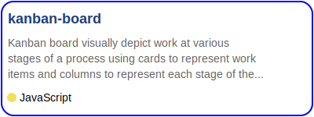</a>&nbsp;&nbsp;&nbsp;&nbsp;&nbsp;
<a href="https://github.com/GrishaAngelovGH/map-ui">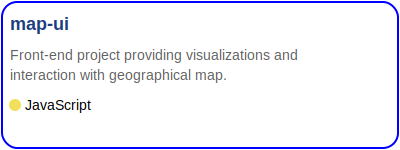</a>
  
&nbsp;&nbsp;&nbsp;&nbsp;&nbsp;

  
&nbsp;&nbsp;&nbsp;&nbsp;&nbsp;

  
<a href="https://github.com/GrishaAngelovGH/machine-learning-exploration">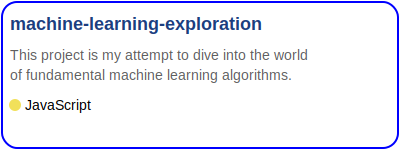</a>&nbsp;&nbsp;&nbsp;&nbsp;&nbsp;
<a href="https://github.com/GrishaAngelovGH/react-tensorflow-qna">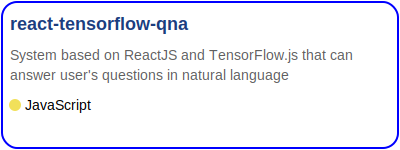</a>
  
<a href="https://github.com/GrishaAngelovGH/algorithms">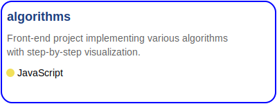</a>&nbsp;&nbsp;&nbsp;&nbsp;&nbsp;
<a href="https://github.com/GrishaAngelovGH/voice-to-map">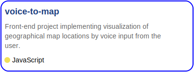</a>
  
<a href="https://github.com/GrishaAngelovGH/grocery-store">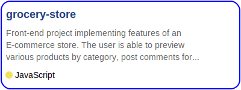</a>&nbsp;&nbsp;&nbsp;&nbsp;&nbsp;
<a href="https://github.com/GrishaAngelovGH/handwritten-digit-recognition">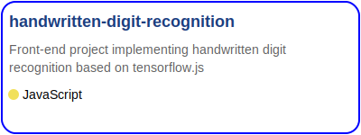</a>
  
&nbsp;&nbsp;&nbsp;&nbsp;&nbsp;

  
<a href="https://github.com/GrishaAngelovGH/graphql-app">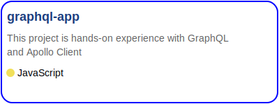</a>&nbsp;&nbsp;&nbsp;&nbsp;&nbsp;
<a href="https://github.com/GrishaAngelovGH/Zustand-App">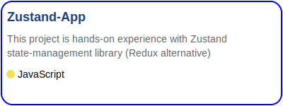</a>
  
<a href="https://github.com/GrishaAngelovGH/infinite-scroll-item-list">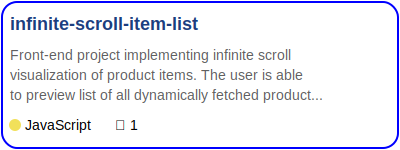</a>&nbsp;&nbsp;&nbsp;&nbsp;&nbsp;

  
<a href="https://github.com/GrishaAngelovGH/rtk-query-stock-app">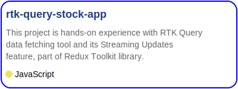</a>&nbsp;&nbsp;&nbsp;&nbsp;&nbsp;
<a href="https://github.com/GrishaAngelovGH/curated-list-of-latest-trends">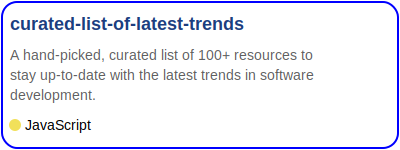</a>
  
&nbsp;&nbsp;&nbsp;&nbsp;&nbsp;

  
&nbsp;&nbsp;&nbsp;&nbsp;&nbsp;

  
&nbsp;&nbsp;&nbsp;&nbsp;&nbsp;

  
<a href="https://github.com/GrishaAngelovGH/responsive-landing-pages">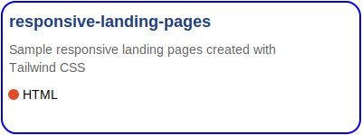</a>&nbsp;&nbsp;&nbsp;&nbsp;&nbsp;

  
<a href="https://github.com/GrishaAngelovGH/filterable-product-list-alpine.js">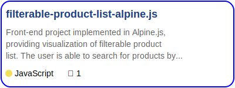</a>&nbsp;&nbsp;&nbsp;&nbsp;&nbsp;
<a href="https://github.com/GrishaAngelovGH/chart-js-carousel">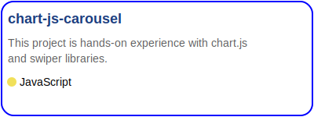</a>
  
<a href="https://github.com/GrishaAngelovGH/design-patterns-in-javascript">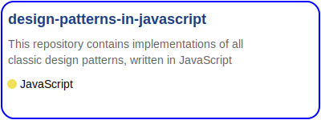</a>&nbsp;&nbsp;&nbsp;&nbsp;&nbsp;

  
<a href="https://github.com/GrishaAngelovGH/react-19-playground">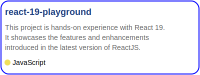</a>&nbsp;&nbsp;&nbsp;&nbsp;&nbsp;
<a href="https://github.com/GrishaAngelovGH/react-conf-2024-notes">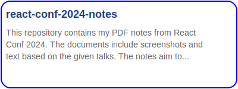</a>
  
&nbsp;&nbsp;&nbsp;&nbsp;&nbsp;
<a href="https://github.com/GrishaAngelovGH/LeetCode-100-algorithms-challenge">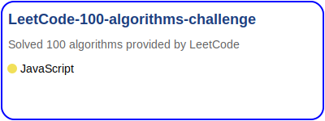</a>
  
&nbsp;&nbsp;&nbsp;&nbsp;&nbsp;

  

# 💻 Technologies and libraries used in projects 8️⃣1️⃣

	
expand</b>&nbsp;the Technologies Panel' : '📂 Click here to&nbsp;<b>collapse</b>&nbsp;the Technologies Panel'"
  >
		📂 Click here to&nbsp;<b>collapse</b>&nbsp;the Technologies Panel
	

   
                                                                           

<!---

--->

<!---

--->

